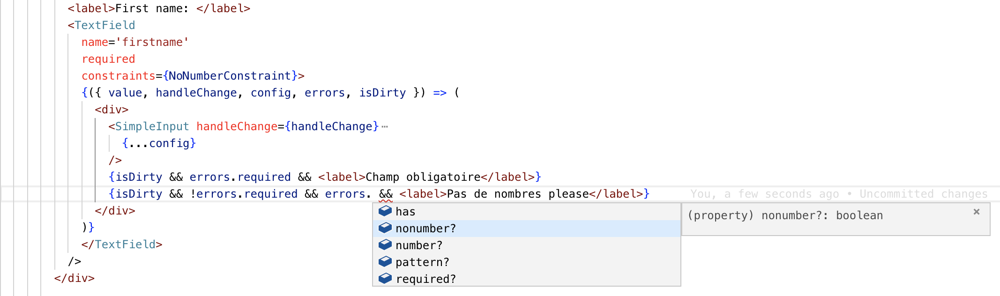

# Fabform

## Motivation

## Installation

## Get started full simple example

```ts
export const AgeConstraint: ValueConstraint<'adult'> = {
  name: 'adult',
  check(val: FormValueType) {
    return val >= 18
  }
}
```ts

```html
    <Form
      onSubmit={(val: PersonFormValues) => {
        console.log(JSON.stringify(values))
      }}>
      validateOn='change'>
        <div>
          <label>First name: </label>
          <TextField
            name='firstname'
            required
            renderer={({ value, handleChange, config, errors, isDirty }) => (
              <div>
                <SimpleInput handleChange={handleChange}
                  value={value}
                  className={isDirty && errors.has ? 'invalid' : undefined}
                  {...config}
                />
                {isDirty && errors.required && <label>Champ obligatoire</label>}
              </div>
            )}
          />
        </div>
        <div>
          <label>Age: </label>
          <NumberField
            name='age'
            required
            constraints={AgeConstraint}>
            {({ value, handleChange, errors, isDirty, config }) => (
              <div>
                <SimpleInput {...config}
                  handleChange={handleChange}
                  className={isDirty && errors.has ? 'invalid' : undefined}
                  placeholder="number" />
                  <div>
                   {isDirty && errors.required && <label>Champ obligatoire</label>}
                   {isDirty && !errors.required && errors.number
                     && <label>Cette valeur n\''est pas un nombre</label>}
                   {isDirty && (!errors.number && !errors.required) && errors.adult
                     && <label>Cette personne n\''est pas adulte</label>}
                   </div>
              </div>
            )}
          </NumberField>
        </div>
    </Form>
```

## Usage

### prepare your data

the form must be populated with a flat objet with key of values pairs

1) create your data type:
 ```js
 export type PersonFormValues = {
  firstname: string,
  lastname: string,
  age: number,
  french: boolean,
}
```
- each key will be used to name any form field
- each value must be of the type ```FormValueType```


2) create initial state
```js
export const personFormValues: PersonFormValues = {
  age: 35,
  firstname: 'jean',
  lastname: 'Dupont',
  french: true,
}
```

### Obtain contextualized components using factory method ```createFormComponent```

```js
const {
  Form,
  TextField,
  NumberField,
  BooleanField,
  SubmitAction,
  ... (other available components)
} = createFormComponents<PersonFormValues>(personFormValues)
```

### Build the form view

#### Form component:
```html
<Form
    onSubmit={yourSubmitCallback}>
      /* add fields */
  </Form>
```

| attribute  | description| type  |  required |
|---|---|---|---|
| onSubmit | callback invoked when submitting form | ```(val:YourFormValuesType) =>void ```  |  true |
| onReset  |  callback invoked when resting form | ```()=>void```  | false  |
| onValueChanged  | callback automatically invoked when a field value has changed  | ```(event:ValueChangedEvent)=>void```  | false   |
| validateOn  |  validation strategy for each field. When not provided all fields will checked before submitting the form| 'blur' or 'change' | false  |


### Fields components

##### Field components are ```TextField, NumberField, BooleanField```
They all accept children as function with the same signature

ex:
```html
<TextField
    name='xxxx'>
    {({ value, handleChange, config, errors, isDirty }) => (
        <input value={value}
                onChange={handleChange}
                {...config}/>
    )}
</>
```

#### Field Common API

|  attribute | description  |  type |  required |
|---|---|---|---|
|  name |  name of the field: must match one of the keys of your custom object |  FormValueType |  true |
|  required |  flags the field as required |  boolean |  false |
|  constraint | extra custom constraints to apply on the field (see dedicated paragraph)  |  ```ValueConstraint<C extends string> or ValueConstraint<C extends string>[]``` |  false |
|  renderer |  external component used to render child |  FC:FieldRendererProps<V extends FormValueType,C extends string> |  false |


#### Text field additional API
|  attribute | description  |  type |  required |
|---|---|---|---|
|  pattern |  a reg. exp. used as constraint|  ```RegExp``` |  false |


#### Field children function common API
|  parameter | description  |  type |
|---|---|---|
|  value |  the current value of the field|  the type of the value with the same attribute in initial state |
|  handleChange |  callback to change the value|  ```(val:FormValueType) => void```  |
|  config |  object that holds input attributes declared on the parent Field|  ```config:{type: FieldType, name: string}```  |
|  errors |  object that holds all generic errors and user derived from user defined constraints|  ```FieldErrors<C extends string>```  |
|  isDirty | flags indicating that the field value was updated at least once|  ```boolean```  |

### Other components
all components can be obtained by the ```createFormComponents``` factory return value

#### ```FormValues```
 provides a way to access to any value of the form anywhere

```html
<FormValues>
  {(values: YourFormValuesType) => (
  )/>
  ```

#### ```SubmitAction```
submit the form
```html
<SubmitAction>
  {(submit) => <button onClick={submit} type='button'>submit form</button>}
</SubmitAction>
```

#### ```ResetAction```
reassign initial values to current form values and re-initialize form state
```html
<ResetAction>
  {reset => <button onClick={reset} className='btn'
    type='button'>reset</button>}
</ResetAction>
```


### constraint API

any number of custom constrains can be applied on TextField and NumberField as long as they are of the following type:

```ts
type ValueConstraint<N extends string> = {
  name: N
  check: (value: FormValueType) => boolean
}
```

the name you provide will be used as a new key in the errors parameter.
for instance adding following constraint on a text field
```ts
export const NoNumberConstraint:ValueConstraint<'nonumber'>={
  name:'nonumber',
  check(val: FormValueType) {
    return /^([^0-9]*)$/.test(val as string)
  }
}
```
then, your IDE should suggest the name in the error parameter in addition to the generic errors.


